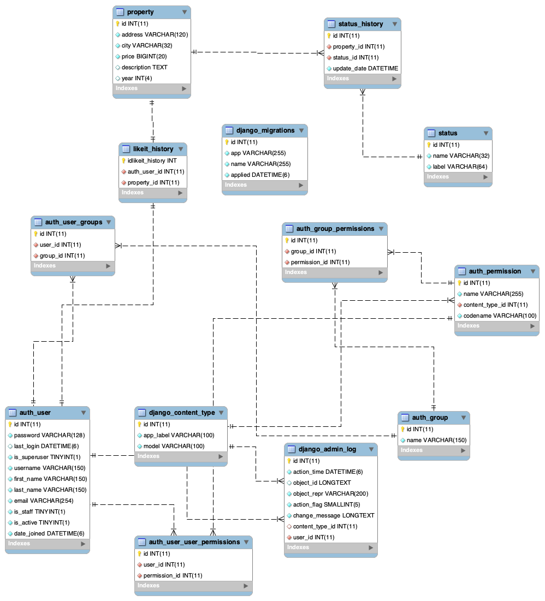

To run:

create env

clone the project

cd project folder

pip install -r requirements.txt

uvicorn main:app --port 8089 --reload

Then go to http://127.0.0.1:8089/docs

Execute GET http://127.0.0.1:8089/property/ without parameters return all the properties

GET  receive     year - city  - status   All are optional parameters. U can filter by zero or more parameters togueters.

Example:
http://127.0.0.1:8089/property/?city=bogota&year=2000&status=pre_venta

Response:
{"results":[[1,"calle 23 #45-67","bogota",120000000,"Hermoso apartamento en el centro de la ciudad",2000]]}

Dudas al inicio:

Nombre de las tablas 

Respuesta:

status_history

property

status

Segundo ejercicio:

Diagrama Entidad Relacion

Codigo SQL para agregar likeit_history

CREATE TABLE IF NOT EXISTS `habi_db`.`likeit_history` (
  `idlikeit_history` INT NOT NULL,
  `auth_user_id` INT(11) NOT NULL,
  `property_id` INT(11) NOT NULL,
  PRIMARY KEY (`idlikeit_history`),
  INDEX `fk_likeit_history_auth_user1_idx` (`auth_user_id` ASC) VISIBLE,
  INDEX `fk_likeit_history_property1_idx` (`property_id` ASC) VISIBLE,
  CONSTRAINT `fk_likeit_history_auth_user1`
    FOREIGN KEY (`auth_user_id`)
    REFERENCES `habi_db`.`auth_user` (`id`)
    ON DELETE NO ACTION
    ON UPDATE NO ACTION,
  CONSTRAINT `fk_likeit_history_property1`
    FOREIGN KEY (`property_id`)
    REFERENCES `habi_db`.`property` (`id`)
    ON DELETE NO ACTION
    ON UPDATE NO ACTION)
ENGINE = InnoDB

